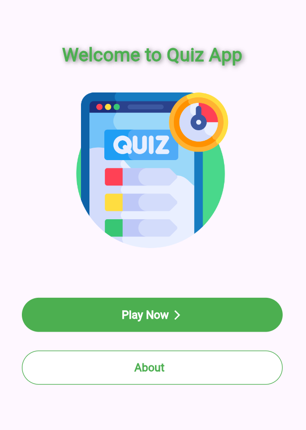
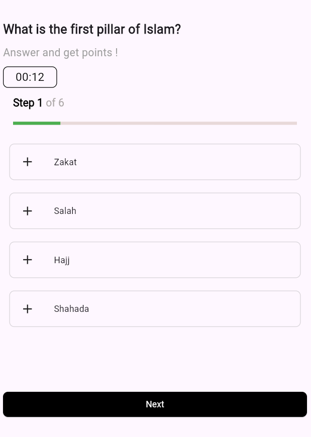
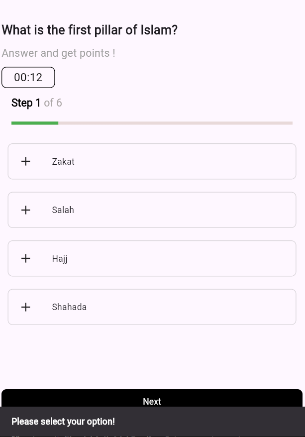
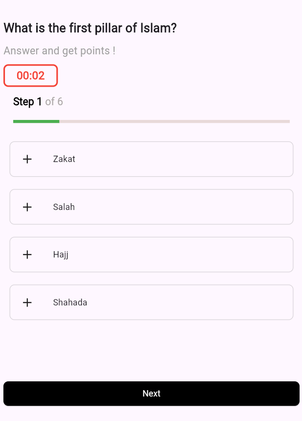
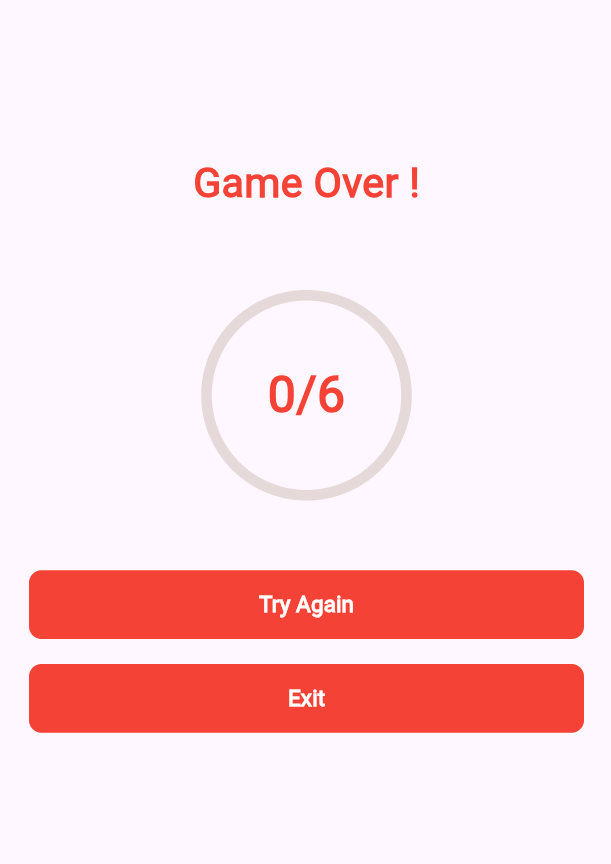
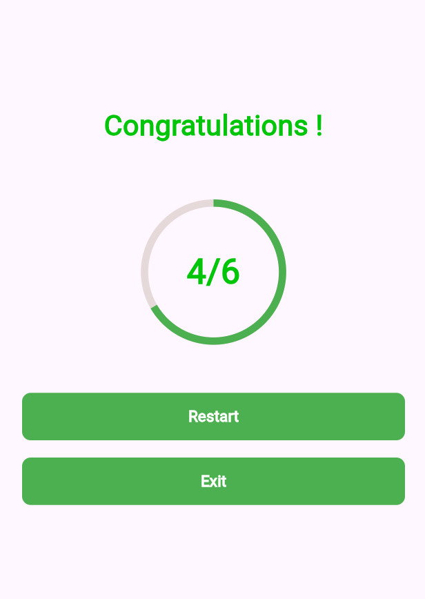

# 📱 Quiz App

A simple and fun Flutter quiz app. It includes a countdown timer, vibration alerts when time runs out, and an easy-to-use interface to test your knowledge.

<br>
<hr>

## 📋 Table of Contents
- [🚀 Overview](#-overview)
- [🌟 Key Features](#-key-features)
- [📸 App Flow & Preview](#-app-flow--preview)
- [🛠️ Tech Stack](#-tech-stack)
- [⚙️ Getting Started](#setup)
- [📱 Features Detail](#-features-detail)
- [📞 Contact](#-contact)


<br>
<hr>

## 🚀 Overview

The **Quiz App** is a straightforward mobile app built for taking quick quizzes. It handles showing questions one by one, tracks your time with a live countdown, and gives you a vibration buzz and a final score when you're finished.

<br>
<hr>

## 🌟 Key Features

- **Smart Timer:** A 15-second countdown that visually alerts the user as time runs out.
- **Haptic Alerts:** Uses device vibration to signal the end of the quiz or time expiration.
- **Progress Tracking:** Real-time progress bar and step counter to keep users engaged.

<br>
<hr>

## 📸 App Flow & Preview

The application follows a structured flow designed for clarity and user engagement:

* **Intro Screen:** A clean landing page with a **"Play Now"** entry point.
* **Idle Quiz State:** Standard gameplay featuring a question, options, and a neutral timer.
* **Validation:** Smart feedback via **SnackBar** if a user tries to skip a question.
* **Critical Alert:** Visual urgency triggered when the timer drops below **5 seconds**.
* **Results:** A comprehensive score summary with **Restart** and **Exit** controls.

---

<p align="center">
  
  
  
  
  
  
</p>

<br>
<hr>

## 🛠️ Tech Stack

- **Framework:** Flutter
- **Language:** Dart
- **Dependencies:**
    - `vibration`: For haptic feedback.
    - `services`: For app navigation and exiting.

<br>
<hr>


<a name="setup"></a>
## ⚙️ Getting Started

### Prerequisites
* Flutter SDK installed on your machine.
* An editor like VS Code or Android Studio.

### Installation

1. **Clone the repository:**
```bash
git clone [[https://github.com/yourusername/quiz-app.git](https://github.com/mahmoudjawad-2025/1-Flutter-QuizApp.git)]([https://github.com/yourusername/quiz-app.git](https://github.com/mahmoudjawad-2025/1-Flutter-QuizApp.git))
```
2. **Install dependencies:**
```bash
flutter pub get
```
3. **Add Assets:** Ensure your images are placed in lib/assets/ and lib/media/ as defined in the code.
4. **Run the app:**
```bash
flutter eun
```

<br> 
<hr>


## 📱 Features Detail

### 🕒 Smart Timer Logic
- The app utilizes a Timer.periodic that monitors the remaining seconds.
- Visual Warning: When _timeLeft <= 5, the container border thickens and the color shifts to Colors.red.
- Haptic Feedback: At 0 seconds, the device vibrates for 500ms using the Vibration package.

### 📊 Scoring System
The final screen calculates if the user passed based on a 50% threshold:
```bash
((QuestionsWithAnswers.length / 2) <= score) 
? 'Congratulations!' 
: 'Game Over!'
```

<br>
<hr>

## 📞 Contact

📧 mahmoudjawad02025@gmail.com

🔗 GitHub: [mahmoudjawad-2025](https://github.com/mahmoudjawad-2025/)

